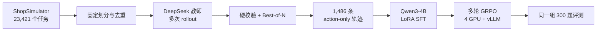

# ShopAgent-Training：教师轨迹蒸馏+多卡 GRPO  购物智能体训练

这是一个端到端的 LLM Agent 训练项目：在 ShopSimulator 购物环境中，我先把原始网页式交互整理成稳定、可复现的标准工具调用任务，再用 DeepSeek 教师模型采集并严格筛选多轮购物轨迹，对 Qwen3-4B 做 action-only LoRA SFT，最后用 verl + vLLM + FSDP2 在 4 张 GPU 上进行多轮 GRPO，让模型不只会调用工具，还能学会搜索、比较、选择和购买。

这项工作的重点不是“把两个训练脚本跑起来”，而是打通下面这条链路，并保证每一步可验证、可恢复、可复现：



## 实验结果

三组模型使用相同的 standard single-turn 配置、相同的 300 个顺序任务（ID 0–299）和相同的工具协议。为了避免 API 失败导致“只统计成功保存样本”的幸存者偏差，主表把缺失样本按 0 分计入，统一使用 300 作为分母。

| 模型 | 有结果 / 300 | 完成购买 | 严格成功 | Loose reward | Hard reward | 正确商品 |
|---|---:|---:|---:|---:|---:|---:|
| Qwen3-4B Base | 202 | 54.00% | 6.00% | 0.2950 | 0.0718 | 17.33% |
| SFT checkpoint-150 | 292 | 96.00% | 38.33% | 0.6659 | 0.3981 | 52.00% |
| GRPO checkpoint-140 | 299 | **99.67%** | **40.33%** | **0.6950** | **0.4156** | **54.67%** |

从 Base 到 SFT，最大的变化是模型从“经常无法完成一条合法购物链路”变成“基本可以稳定完成任务”；GRPO 则在这个基础上继续提高选择质量、减少无效探索。平均工具调用次数从 Base 的 **16.63** 降至 SFT 的 **5.82**，再降至 GRPO 的 **4.49**。

## 项目方案

### 1. 环境改造为可靠的训练基础设施

ShopSimulator 提供了商品、用户指令、页面状态和评分逻辑。本项目复用了这部分环境与 benchmark，主要新增和改造的是轨迹采集、数据清洗、SFT、GRPO、并发会话管理与评测链路，而不是把上游环境本身包装成原创成果。

原始 Agent 接口更接近页面操作，训练时却需要一个严格、稳定的 tool-call 协议。我首先统一了 `search`、`click`、`back`、`purchase` 等动作的 schema，让单模型评测、教师采集和 GRPO 都复用同一套 `ShopToolAdapter`。同时做了三件会直接影响实验可信度的工作：

- 将模型可见 observation 与内部 diagnostics 分离，避免 reward、目标商品等特权信息泄漏进上下文。
- 支持顺序采样与带 seed 的随机采样，保存 task pool 和 run metadata，断点恢复后仍能复现同一组任务。
- 把无效 click、同状态重复动作转为可恢复 observation，并限制连续校验失败次数，避免一次格式错误直接摧毁整个 rollout。

环境和训练代码现在位于同一个仓库中；模型、checkpoint、原始 rollout 和日志通过 `.gitignore` 留在本地数据盘。

### 2. 蒸馏教师轨迹：action-only，关注教师的每次动作决策

从 23,421 个任务中构造了固定数据池。候选训练池避开评测指令，使用 seed 42 分层抽取 2,000 题：600 simple、1,000 medium、400 hard；另建 400 题的 online-dev 池，且两个池之间没有指令重合。清单及 SHA256 会随运行保存，防止后续不知不觉换了数据。

教师使用开启 thinking 的 DeepSeek 模型。每个任务生成多个候选 rollout，然后分两步选数据：

1. **硬校验**：reward 必须为 1；ASIN、属性、选项、价格和商品类型必须与任务一致；必须正常 purchase 结束；不得出现隐藏重试、工具错误、消息角色错序、tool ID 不匹配、不可用 click/search、同状态重复动作或特权标签泄漏。
2. **Best-of-N 排序**：只在硬校验通过的候选中选择，依次偏好更少重复动作、更少工具调用、更少 completion token，最后用 rollout ID 稳定打破平局。

当前代码默认支持 Best-of-4；本次实际用于 SFT 的历史采集产物是 **2,000 题 × 2 次 = 4,000 条 rollout（Best-of-2）**。其中 2,251 条通过硬校验，最终有 1,486 个任务至少存在一条可用轨迹：

| 教师数据指标 | 数值 |
|---|---:|
| 候选任务 | 2,000 |
| 原始 rollout | 4,000 |
| 硬校验通过 rollout | 2,251（56.28%） |
| 至少一条通过的任务 | 1,486（74.30%） |
| 入选轨迹平均工具调用 | 5.56 |
| 入选轨迹平均重复动作 | 0.20 |
| 精确 ASIN / option 一致率 | 100% / 100% |

原定目标是 1,500 条，实际少 14 条。SFT 阶段对 1,486 条有效轨迹重新用 seed 42 划分为 1,337 条训练数据和 149 条验证数据。

导出时删除教师的 `reasoning_content`，清空 assistant 普通文本，只保留结构化工具动作，并清空最后一个可能含 reward/目标信息的 terminal tool response。原始 reasoning 版本只用于离线审计。这是**行为轨迹蒸馏**：学生学习在某个环境状态下采取什么合法动作，而不是模仿教师的私有思维链。

### 3. SFT：只对 Agent 的动作计算 loss

SFT 从 Qwen3-4B 开始，使用 rank-32 LoRA，覆盖 attention 和 MLP 的 `q/k/v/o/gate/up/down_proj`。核心参数如下：

| 参数 | 配置 |
|---|---|
| 数据 | 1,337 train / 149 eval |
| 序列长度 | 8,192 |
| Epoch | 3 |
| Micro batch / 累积 | 1 / 8（有效 batch 8） |
| 学习率 | `2e-4`，3% warmup |
| LoRA | rank 32 / alpha 64 / dropout 0.05 |
| 精度与算子 | BF16、TF32、SDPA、gradient checkpointing、fused AdamW |

训练不是普通的全对话 language modeling。system、user、tool response、assistant header、空 thinking 前缀和 padding 的 label 全部设为 `-100`，只有下面的结构化动作参与 loss：

```text
<tool_call>
{"name": "search", "arguments": {"keywords": "..."}}
</tool_call><|im_end|>
```

这一步解决了三个容易被忽略、但会直接造成“loss 正常，Agent 不会用”的问题：

- **Qwen chat template 没有 generation span**：模板虽然能序列化 tools，但 `assistant_masks` 全为 0。我在内存中为 assistant 区域注入 ``，再校验真实 tokenizer 生成的 mask。
- **非思考模式存在训推前缀错位**：在线 prompt 会预填充空的 `<think>...</think>`，历史 assistant 消息却没有。我在训练样本中加入同样前缀并屏蔽其 loss，保证训练与 vLLM 推理格式一致。
- **截断可能留下半段 JSON**：如果先按 token 粗暴截断，模型会被迫学习不完整 tool call。现在先套模板和构造 mask，再截断；末尾动作一旦不完整，就整体移除该动作的监督标签。

完整 SFT 训练到 step 500。验证 loss 在 step 125 最低（0.1262），而 checkpoint 每 50 step 保存一次；后续统一评测和 GRPO 使用了已经合并的 checkpoint-150（eval loss 0.1300），避免在实验中途切换基线。

### 4. GRPO：从“会操作”优化到“会决策”

SFT 解决格式和基本策略后，我用 GRPO 优化多轮决策。训练基于 verl 的同步 trainer 和官方 async multi-turn rollout：vLLM 负责批量生成，ShopSimulator 负责环境状态、动作校验和 reward，FSDP2 负责 4 卡参数训练。

本次 `qwen3-4b-grpo-safe` 实际运行配置为：

- 4 × NVIDIA RTX 4080 SUPER；每个 prompt 采样 4 条轨迹，形成 GRPO 组内相对优势。
- Qwen3-4B SFT checkpoint-150 作为冻结 base，在其上训练新的 rank-32 / alpha-64 LoRA。
- Actor 使用 FSDP2、BF16 和 CPU offload；rollout 使用 vLLM。
- temperature 0.7、top-p 0.8、top-k 20；学习率 `1e-5`；KL 系数 `0.001`。
- 实际安全运行使用 train batch 1、每题 4 个 rollout，prompt 上限 1,024、response 上限 8,192、总上下文上限 24,576。
- 当前 launcher 已扩展为默认 4 prompts × 4 rollouts = 16 个并发环境 session，并会拒绝超过环境 20 slots 的配置。

独立的 62 题 validation 在训练过程中保持不变：

| Step | Reward | 严格成功 | Quality | Regret | 平均动作数 |
|---:|---:|---:|---:|---:|---:|
| 20 | 0.3632 | 67.74% | 0.8521 | 0.0885 | 5.016 |
| 60 | 0.4274 | 70.97% | 0.8696 | 0.0756 | 4.984 |
| 80 | 0.4678 | 72.58% | 0.8962 | 0.0812 | 4.419 |
| 120 | 0.4406 | 70.97% | 0.8985 | 0.0743 | 4.387 |
| 140 | **0.4705** | **72.58%** | **0.9006** | **0.0722** | **4.355** |

step 20 到 step 140 的 validation reward 提升约 29.5%。曲线不是单调的，这也符合 on-policy RL 的方差特征；因此我同时记录 reward 均值/方差、严格成功、各约束分量、regret、重复/无效/back/action 数和终止原因，而不是只盯一条总 reward 曲线。

## GRPO Reward 是怎样设计的

购物任务的难点在于：只奖励最终成功，信号太稀疏；给搜索和返回直接加分，又很容易被 Agent 刷步数。我的 Reward V1 只评价结果质量和明确的坏行为，不给普通步骤奖励。

对购买结果先计算：

```text
Q = C_type × (0.45 × C_attr + 0.40 × C_option + 0.15 × C_price)
```

- `C_type` 是硬门控：必须精确命中 ASIN，或命中非空的完整商品类型；泛化类别重合不能过关。
- `C_attr` 衡量自然语言属性满足比例。
- `C_option` 衡量颜色、尺寸、容量等 SKU 选项满足比例；匹配允许有限模糊，但数值约束受保护，例如 50W 不能匹配成 500W。
- `C_price` 使用用户可见预算和最终选择 SKU 的真实价格，而不是同商品另一个便宜 variant 的价格。

最终规则：严格正确购买得到 `+1.0`；错误购买得到 `-1.0 + 0.2Q`；超时或上下文/历史达到上限为 `-1.05`；格式错误或没有动作导致终止为 `-1.10`。如果买到的商品比模型已经看过的最佳商品差，再加：

```text
-0.2 × max(0, Q_best_seen - Q_purchase)
```

同状态重复动作每次扣 0.05、最多扣 0.20；无效动作每次扣 0.05、最多扣 0.10；最终 reward clamp 到 `[-1.5, 1.0]`。我没有设置通用 step penalty，也没有奖励 `back`：有用的返回操作通过避免错误购买自然获益，无意义循环则由重复动作和失败结局惩罚。

另外，服务崩溃、网络异常等基础设施问题会抛出 `InfrastructureRewardError`，不会伪装成模型的负样本。否则 RL 会错误地把“环境挂了”学习成“这个动作不好”。

## 三组评测的进一步分析

如果采用评测脚本原本的口径——只对成功写入 top result 的样本求平均——结果如下。它便于复核原始报告，但会让 Base 因 98 个失败样本未进入分母而显得更好，所以不作为本 README 的主结论。

| 模型 | n | 完成购买 | Strict success | Loose | Hard | Type | Attr | Option | Price |
|---|---:|---:|---:|---:|---:|---:|---:|---:|---:|
| Base | 202 | 80.20% | 8.91% | 0.4381 | 0.1066 | 0.7698 | 0.4953 | 0.1452 | 0.6535 |
| SFT-150 | 292 | 98.63% | 39.38% | 0.6841 | 0.4090 | 0.9675 | 0.7369 | 0.5120 | 0.7226 |
| GRPO-140 | 299 | **100.00%** | **40.47%** | **0.6973** | **0.4169** | **0.9783** | **0.7471** | **0.5251** | **0.7458** |

终止 diagnostics 解释了主表变化：Base 有 98 次 LLM/API error 和 40 次 history limit；SFT 降到 8 次 error、4 次 history limit；GRPO 只有 1 次由重复 click 校验失败导致的 error，其余 299 题都完成 purchase。

结论可以拆成两层：

1. **教师行为蒸馏解决可用性**：SFT 带来最大的跃升，说明合法工具协议、短路径示范和一致的训推模板是 Agent 能工作的前提。
2. **GRPO改善效率和决策质量**：在 completion 已接近饱和后，GRPO 仍提高各约束分量，并显著减少动作和重复。当前最低的仍是 `C_option`，说明细粒度 SKU 选项选择是下一阶段最值得优化的瓶颈。

## 仓库结构

```text
ShopAgent-Training/
├── shopSimulator/
│   ├── shop_env/                 # 环境、商品数据与 20-slot API
│   ├── single_eval/              # Base / SFT / GRPO 统一评测
│   ├── trajectory_collection/    # 教师采集、校验、Best-of-N 与导出
│   ├── task_selection.py         # 可复现任务采样
│   └── tool_adapter.py           # 三条链路共享的标准工具协议
├── sft/
│   ├── train_sft.py              # action-only LoRA SFT
│   ├── masking.py                # 模板与 token-level loss mask
│   ├── configs/                  # 正式 / smoke 配置
│   └── tests/
├── rl/
│   ├── prepare_dataset.py        # 预算解析、冲突过滤与 manifest
│   ├── reward.py                 # Reward V1 与 diagnostics
│   ├── shop_tool.py              # verl ↔ ShopSimulator 工具桥
│   ├── agent_loop.py             # 多轮 rollout 生命周期
│   ├── run_grpo.sh               # 多卡 GRPO launcher
│   └── tests/
└── README.md
```

## 复现入口

### 1. 环境与测试

```bash
cd /root/ShopAgent-Training
PYTHONPATH=$PWD:$PWD/shopSimulator \
  /root/miniconda3/envs/rl/bin/python -m unittest discover -s rl/tests -v
```

轨迹采集、SFT mask 和 ShopSimulator 还有各自的测试；当前项目相关测试共 **64 项通过**。更详细的依赖和命令见 [ShopSimulator](shopSimulator/README.md)、[轨迹采集](shopSimulator/trajectory_collection/README.md)、[SFT](sft/README.md) 和 [GRPO](rl/README.md)。

### 2. 教师采集与整理

```bash
cd /root/ShopAgent-Training/shopSimulator
python trajectory_collection/pipeline.py prepare \
  --config trajectory_collection/configs/collection.yaml
python trajectory_collection/pipeline.py collect \
  --config trajectory_collection/configs/collection.yaml \
  --manifest candidate_ids.json
python trajectory_collection/pipeline.py curate \
  --config trajectory_collection/configs/collection.yaml \
  --manifest candidate_ids.json
```

### 3. SFT

```bash
cd /root/ShopAgent-Training/sft
./scripts/run_train.sh --validate-only
./scripts/run_train.sh
```

### 4. GRPO

```bash
cd /root/ShopAgent-Training
bash rl/start_shop_env.sh       # 终端 1：20-slot 环境
bash rl/run_smoke.sh            # 终端 2：先跑端到端 smoke
bash rl/run_grpo.sh             # 再启动正式多卡训练
```
